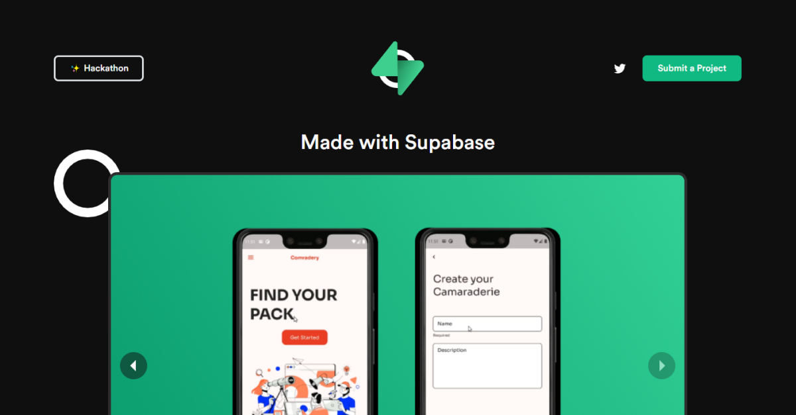
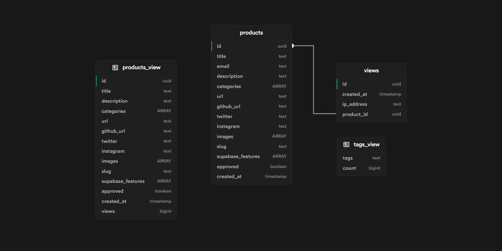

<!-- PROJECT LOGO -->
<br />
<p align="center">
  <a href="https://github.com/zernonia/madewithsupabase">
    
  </a>

  <h2 align="center"><strong>Made with Supabase ⚡</strong></h2>

  <p align="center">
  A collection of projects made with <a href="https://supabase.io/">Supabase</a>
    <br>
    Websites, Mobile Apps, SaaS, Plugins and more!
    <br />
    <br />
    <a href="https://madewithsupabase.com/">View Demo</a>
    ·
    <a href="https://github.com/zernonia/madewithsupabase/issues">Report Bug</a>
    ·
    <a href="https://github.com/zernonia/madewithsupabase/issues">Request Feature</a>
  </p>
</p>



## 🚀 Features

- ✨ Curated list of projects
- 🎉 Show the world your creation using Supabase
- 🔎 Search by tags, for Supabase service
- 💚 Hackathon submission (during event period)

## 📇 About The Project

As the name suggest, this project is a collection of projects that made with Supabase! It was heavily inspired by other "Made with xxx" website, and I wanted to curate all the submission for the first ever [Supabase Hackathon](https://supabase.com/blog/2021/07/30/1-the-supabase-hackathon).

Also, I thought that this would be a great opportunity to use **Supabase Database and Storage** to showcase Supabase!

Therefore, [Made with Supabase](https://madewithsupabase.com) is also, made with Supabase ⚡!

It turns out that this project gained a lot of attention from Supabase users, as well as not-yet Supabase user 😂. It grew from 10+ projects to 100+ now! Supa awesome!!! 🔥 I believe it has potential to grow, thus I've decided to Open Source it, and welcome your contributions!

-- From: `zernonia`

### 🔨 Built With

- [Supabase](https://supabase.io/)
- [Nuxt 3](https://v3.nuxtjs.org/)
- [Vite](https://vitejs.dev/)
- [WindiCSS](https://windicss.org/)
- [Vercel](https://vercel.com)

## Supabase Schema/Script

[](https://supabase-schema.vercel.app/)

### Table

`products`

```sql
create table products (
  id uuid default uuid_generate_v4() primary key,
  title text,
  email text,
  description text,
  categories ARRAY,
  url text,
  github_url text,
  twitter text,
  instagram text,
  images ARRAY,
  slug text,
  supabase_features ARRAY,
  approved boolean,
  created_at timestamp default now()
);

-- enable RLS
alter table products enable row level security;
```

`views`

```sql
create table views (
  id uuid default uuid_generate_v4() primary key,
  created_at timestamp default now(),
  ip_address text,
  product_id uuid references products (id) on delete cascade
);

-- enable RLS
alter table views enable row level security;
```

### Views

`products_view`

```sql
select products.id,
  products.title,
  products.description,
  products.categories,
  products.url,
  products.github_url,
  products.twitter,
  products.instagram,
  products.images,
  products.slug,
  products.supabase_features,
  products.approved,
  products.created_at,
  count(views.id) as views
  from products
    left join views on products.id = views.product_id
  where products.approved = true
  group by products.id;
```

`tags_view`

```sql
select s.tags,
  count(*) as count
  from ( select unnest(products.categories) as tags
    from products
    where products.approved = true) s
  group by s.tags;
```

### Function

`get_related_products`

```sql
create or replace function public.get_related_products(parent_id uuid)
  returns setof products_view
  language plpgsql
as $$
begin
  return query
    select * from products_view where id <> parent_id order by random();
end; $$
```

`get_tags`

```sql
create or replace function public.get_tags(tag text)
  returns setof products_view
  language plpgsql
as $$
begin
  return query
    select * from products_view where tag % any(categories);
end; $$
```

`get_supabase_tags`

```sql
create or replace function public.get_supabase_tags(tag text)
  returns setof products_view
  language plpgsql
as $$
begin
  return query
    select * from products_view where tag like any(supabase_features);
end; $$
```

## 🌎 Local Development

### Prerequisites

Yarn

- ```sh
  npm install --global yarn
  ```

### Development

1. Clone the repo
   ```sh
   git clone https://github.com/zernonia/madewithsupabase.git
   ```
2. Install NPM packages
   ```sh
   yarn install
   ```
3. Run Development instance
   ```sh
   yarn dev
   ```

## ➕ Contributing

This project is just for fun, but if you have any crazy idea for Realtime function, feel free to contribute, or create request for the features. Any contributions you make are **greatly appreciated**.

1. Fork the Project
2. Create your Feature Branch (`git checkout -b feature/AmazingFeature`)
3. Commit your Changes (`git commit -m 'Add some AmazingFeature'`)
4. Push to the Branch (`git push origin feature/AmazingFeature`)
5. Open a Pull Request

## 📜 License

Not Associated with Supabase.

Distributed under the MIT License. See `LICENSE` for more information.

## 📧 Contact

Zernonia - [@zernonia](https://twitter.com/zernonia)

## ☕ Support

If you like my work, please buy me a coffee 😳

[](https://www.buymeacoffee.com/zernonia)
